
# Fast Budject App

## Description

This is a simple budget app that allows you to add and remove expenses and income. It also shows you the percentage of your expenses in relation to your income. This app cloned from https://fastbudget.app. Completed in one week. The app is written in Asp.Net Core MVC. 

## Features

- Visualize the flow of your money at a glance with a fully customizable Overview page.
  Here you can find the balance of your last days together with the accounts, cards and budgets you use most frequently.
- You can view the most important information relating to an account with many charts and reports.
  There is also an entire section dedicated to credit cards.
- Manage your daily expenses as you wish. You can create unlimited categories and subcategories to track them better. Scheduled transactions and transaction templates will help you to speed up the insertion of new transactions.

## Some screenshots

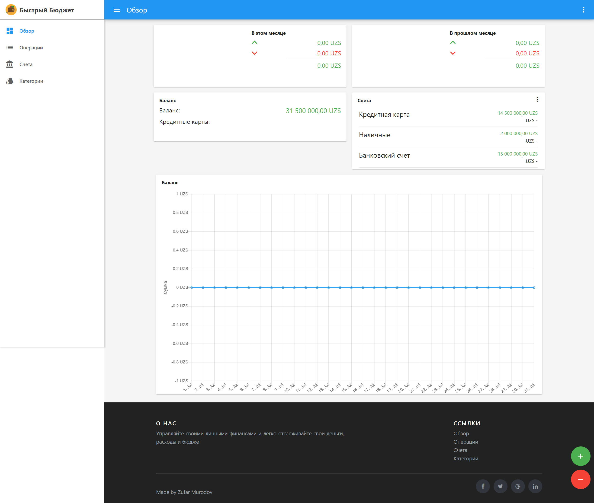
Home page

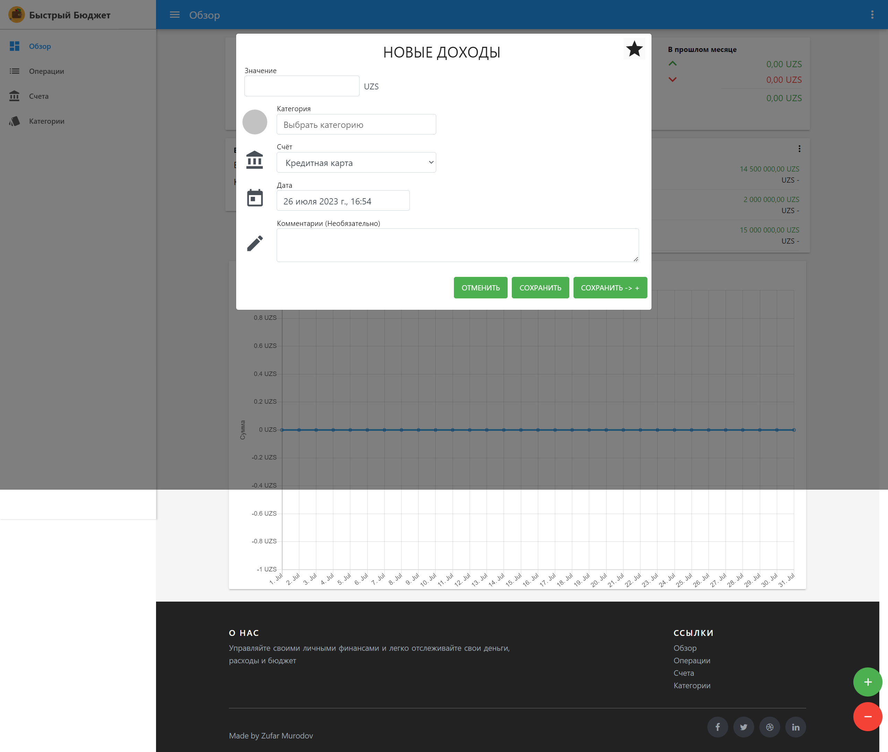
Add new income transaction dialog

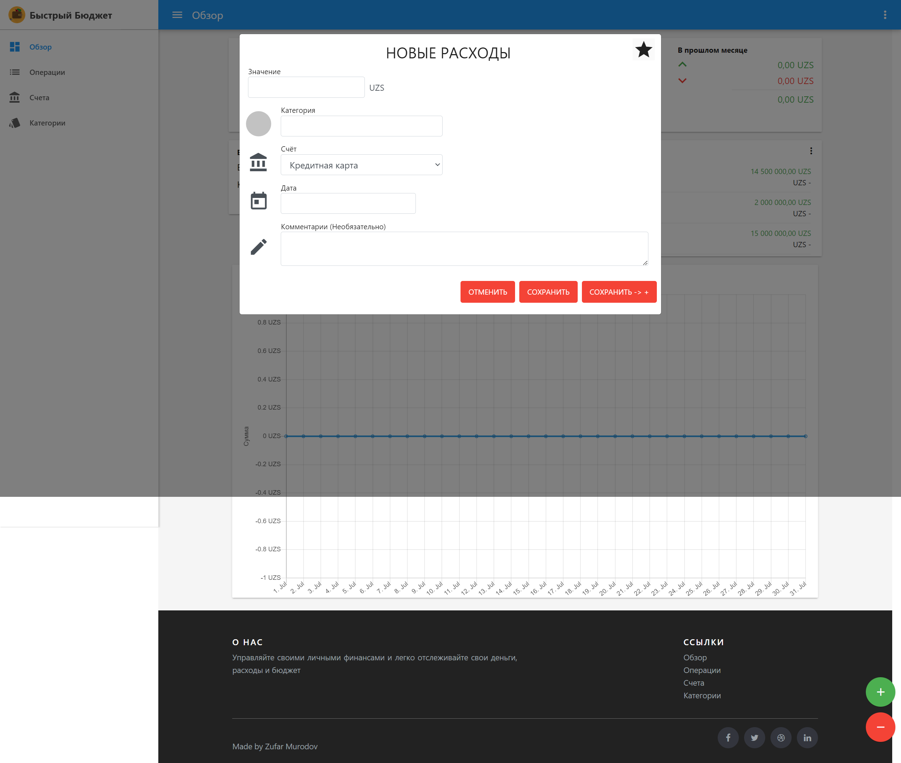
Add new expense transaction dialog

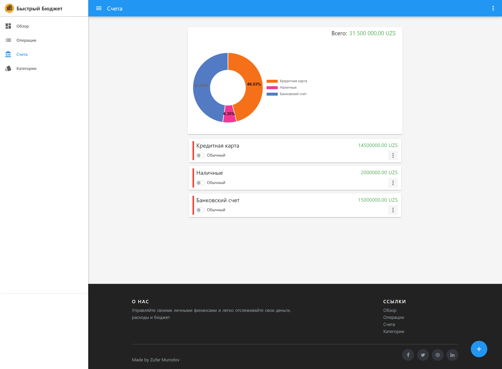
Accounts page

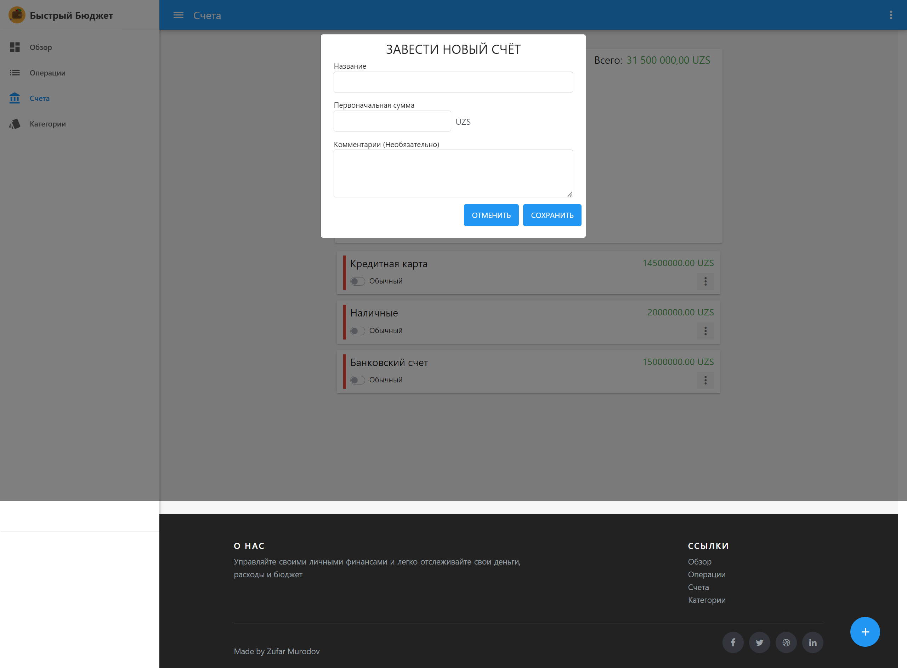
Create account dialog


Edit account dialog

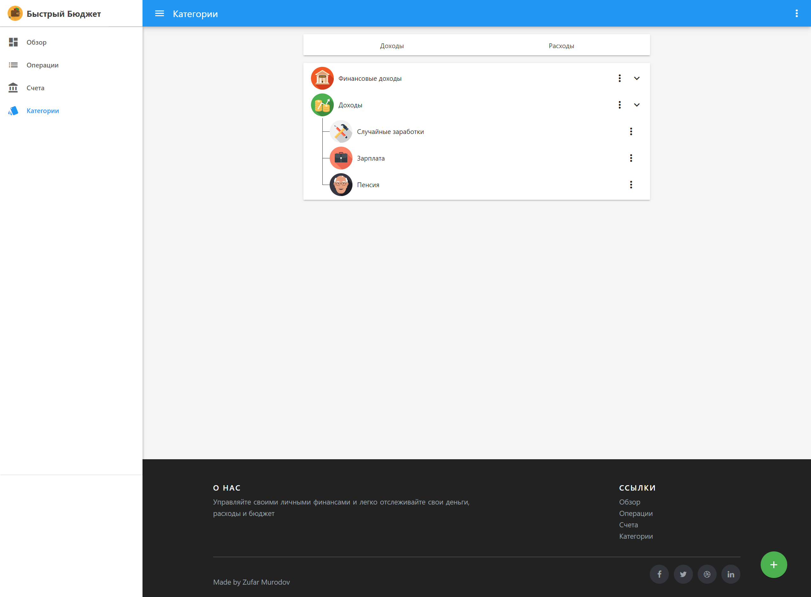
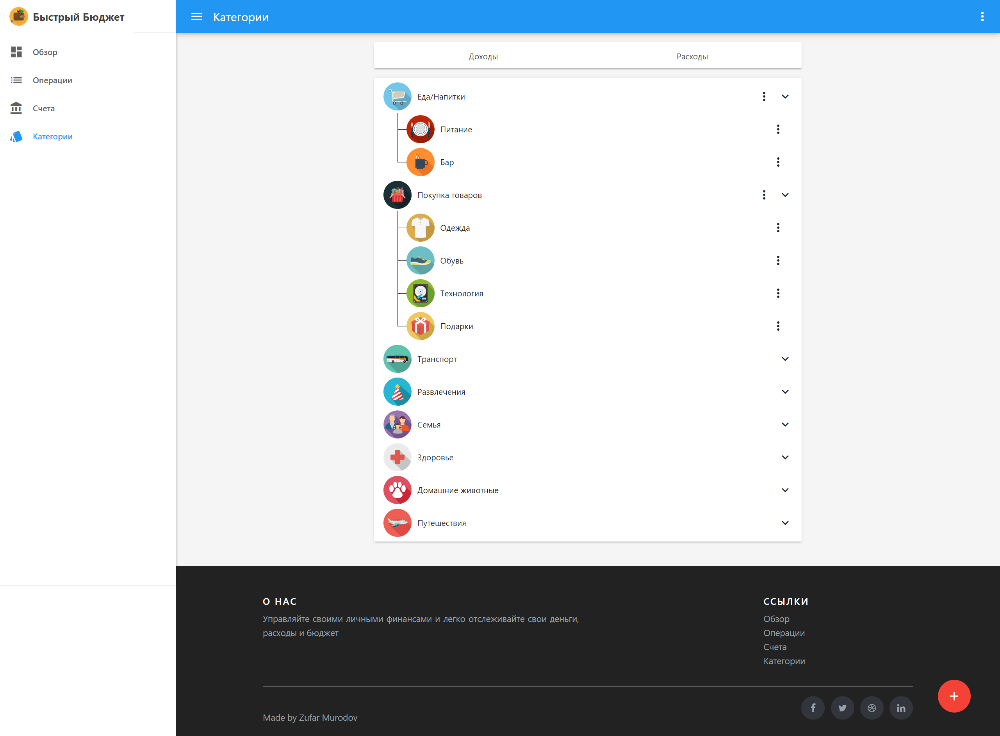
Categories page

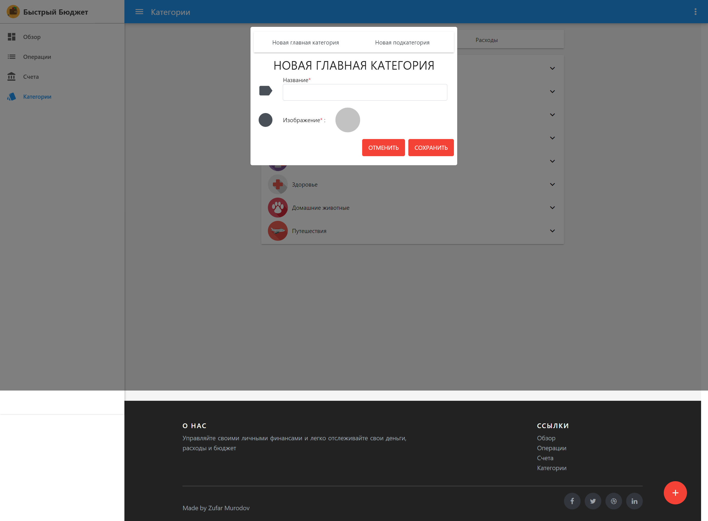
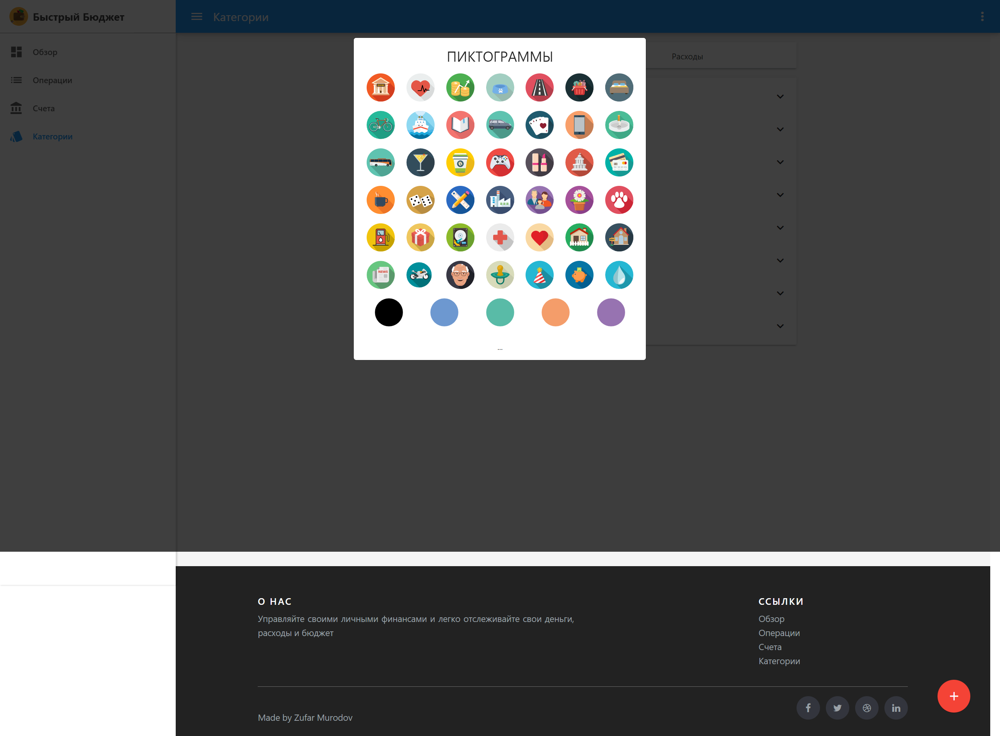
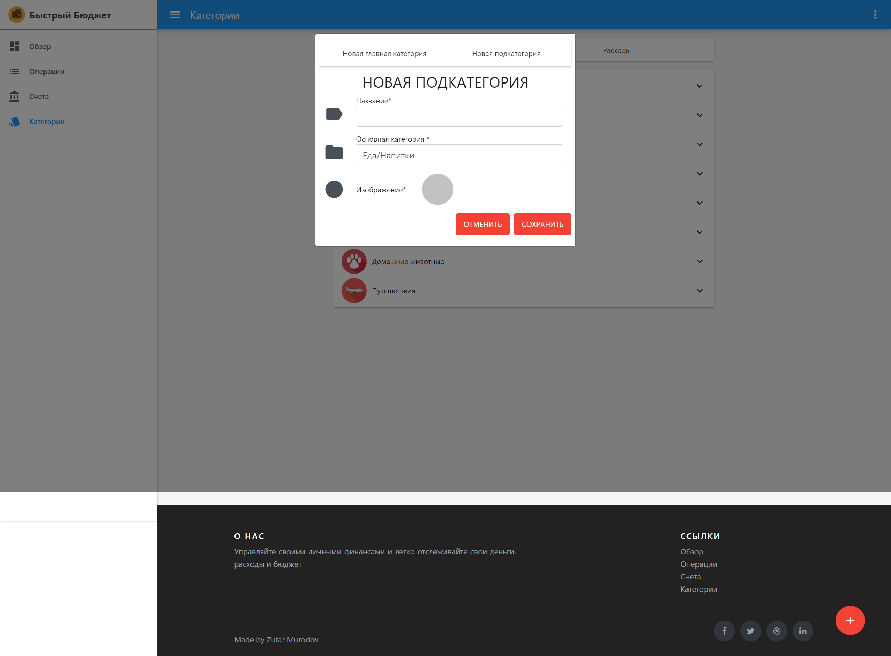
Create category dialog

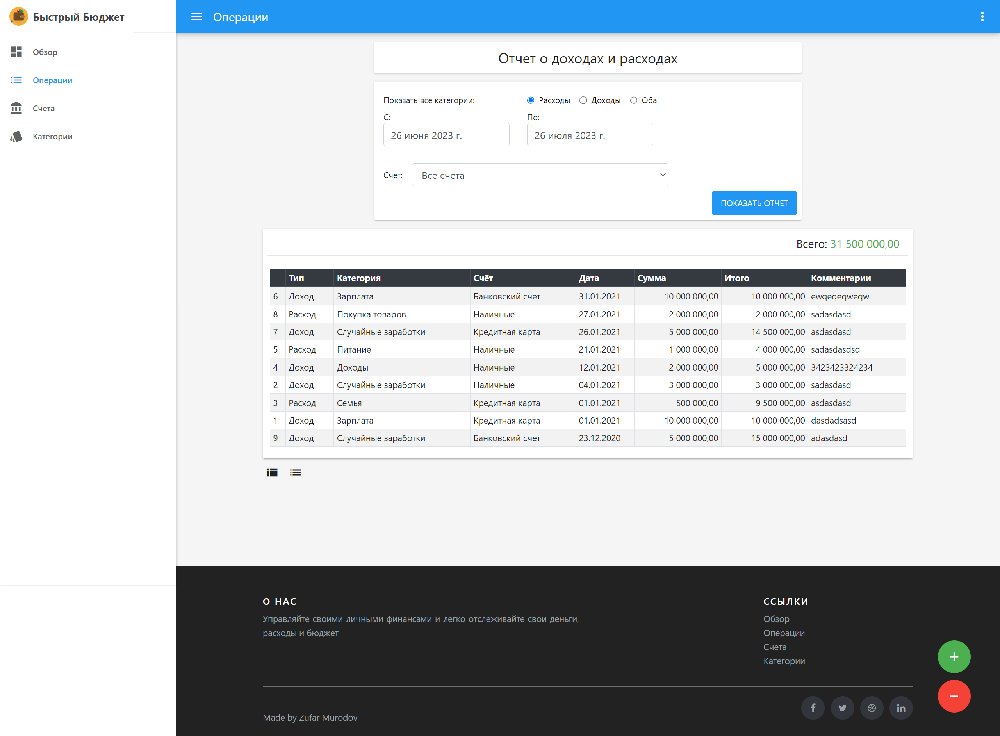
Transactions history page


## Demo video:

https://drive.google.com/file/d/1oLfyaTk-n2iICrD6UVMJS81pBq4YpZXO/view?usp=sharing

## Installation

To set up the project locally, follow these steps:

1. Clone the repository using the following command:

```bash
git clone https://github.com/zmurodov/fast-budject.git
```

1. Navigate to the project directory:

    ```bash
    cd fast-budject
2. Restore the required NuGet packages:

    ```bash
    dotnet restore
3. Build the solution:

    ```bash
    dotnet build

4. Run the project:

    ```bash
    dotnet run


## Usage
Open your web browser and navigate to the running application.
